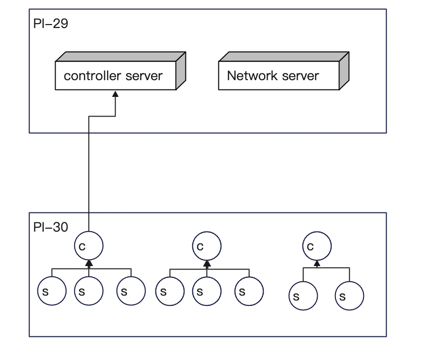

---

---

# scalable_project_3
Space Mail!

## Project Initializtion Commands
- `python3 -m venv .venv`
- `source .venv/bin/activate`
- `python3 -m pip install -U pip`
- `python3 -m pip install -r requirements.txt`

## Version 1
- Ships.py: Newly created file contains the ships class
- ShipControlerManagement.py: Functions for Ship mangement from the controler end
- StationaryStations.py: Contains the code for the Starting and end points stationay stations for the ships to traverse between. (Removed in version 2)

## Version 2
- EntityServer.py: Server type that manages all the existing ship entities in the network. This server is also responsible for the management of the network creationa and network controller selection.
- ControllerServer.py: Manages all the network controllers. It handles all incoming requests (including manually injected messages) and redirects the message to the coresponding controller.
- GodServer.py: A server that handles the complete virtualization. It is responsible for initializing objects and handling the controller
## Running the thing

There are two commands that need to be run (may be unified in the future), first you need to launch the simulator on an allowed port, and then you need to start the script which launches the entities (just stations for the moment).

### localhost
In a local development environment open two terminals and in the first one run:
(no need for --host or --port)

	python main.py 

To create a station and have it connect run:

	python start_station.py localhost 5000 CAFEBABE

### Raspberry Pi

On the pi, you have to first get your ip address, then start with:

	python main.py --host 0.0.0.0 --port 33000

and in a second terminal, run:

	python setup_stations.py --host <the ip address of the pi running the sim> --port 33000

The ip addresses are (for the time being):

	rasp-029: 10.35.70.29
	rasp-030: 10.35.70.30

## NOTE

Because the ssh connection needs to activate the virtual env, you'll need to have the repo under the path:

	/users/pgrad/{USER}/projects/scalable_project_3

In the future we can make this configurable, but right now just put the repo under $HOME/projects/ and put your venv there and it should work.

# Project Outline

The purpose of this project is to simulate sending email (space mail) between entities in the solar system, who have no direct method of communication (no phone lines between Earth and Mars) and so must rely on currier ships. There are four simulated entity types:

	* Messages: These are the data objects which make their way from a source to their destination
	* Ships: These entities are present in the space. Multiple ships form an ephimeral network with one of the network acting as the network controller.
	* Network controller: It is the onldest node in the network which acts as the bridging node for all communication that happen withing the network.
	* Entity Server: It is the server that controls all the ships present in space. It is also responsible for managing and updating the ephimeral networks.
	* Controller Server: This server is responsible for handling the network controller ships. It redirects the messages to the corresponding network and manages the flow messages including the ones manually injected in the system.
	* Physics Simulator: In the real world we would call this base reality, however since were not actually sending email to Neptune we’ve gotta simulate it somehow. The physics simulator keeps track of the global state of the system, and mediates communication between the other entities.

There exists multiple ships in open space. Each ship has a communication range, multiple interconnected ships thus creating a chained network. All communication in the network are controlled, managed and acted on by the oldest node in the network (network controller). The simulator will initialize a new ship at a random time, location, speed and communication range. 

The simulator is also responsible for triggering an update function. Each entity will have its update cycle, and during its update will perform the following actions:

1. Updated locations of the ships basis the delta time difference since the last update and the speed of the ship.
2. Check if any new ship connections have been mande basis the updated locations.
3. Create/Updated the ephimeral network basis the new ship positions and connections. This would also including merging of networks there is communication chain link created between the two.
4. Create any new network controllers in case of a newly initiated network. Remove a controller of the smaller network in the event where two networks merge to create a single ephimeral network.



## Message

The message object is our atomic data unit and consists of the following:

	* Sender, name and station location
	* Receiver, name and optionally last known location
	* checksum
	* if we have time and decide to get fancy, public key of the sender

## Ship

A Ship is basically a much smaller mobile station. The crew on a ship may also generate and receive messages. The ships can only communicate with other ships which are in its commication reange and effectively relay infromation to the nodes that are part of the ephimeral network. Ships have the following:

	* Name, the ship identifier
	* Crew, a relatively small number of people on the ship
	* Message list, a list of the messages the ship is carrying
	* Communication range, a potentially fixed radius around the ship that its able to transmit messages. If we get fancy, we can decide to have this variable between ships to make things more interesting.
	* Speed, the rate of movement through the celestial aether.	
	* A bunch of simulated sensor stuff, TBD

## Network Controller

A ship that is the oldest entity in the network. It processes every messages that is passed throught the network. The messages may be inter ship communications, action messages or those that need to be processed before being relayed as a broadcast message to all the nodes in the network. A controller has the following

	* All properties of a ship
	* List of ships that are part of the Ephimeral network.
	* Capability to mange and process the messages being relayed throught he network.

## Entity Server
A server that handles all the ships. It is responsible for manageing and creating ephimeral networks and updating the ship and the network properties with respet to time. It is also responsible for updating and nominating the network controller.

## Controller Server
Like the entity server this server is reponsible for handling all the network controllers. The controllers server handles all the externally injected messages comming into the ntwork and accordingly routing it throught the main controller that is responsible for the relaing the information the the intended ship.

## Physics Simulator

The simulation of base reality. The simulator manages both the entity and the controller server. The simulator randomly injects new ships in the network and removes a few. The Simulator is also responsible for triggering the update operation that runs on all the ships to update their properties. The simulator will also be responsible for injecting new and random events in the system triggering actions by the controllers and effectivly the ships in the network.

# API

## Version 1

### remove_entity
	ENDPOint: /remove_entity
	PARAMS:
			entity_id: either a ship or station id
	RETURNS:
			status 200 if the entity was successfully removed, 400 otherwise
	
	Does what it says on the tin.

### add_ship
	ENDPOINT: /add_ship
	PARAMS: 
	        ship_id (str): New Ship ID
	        speed (str): Ship's Speed
	        comRange (str): Ship's Communication range
	        loc (tuple): Ships location
	RETURNS: 
			200 if successful, 400 otherwise
	
	Adds a new row in the ships dataframe.

### add_ship
	ENDPOINT: /add_station
	PARAMS: 
	        station_id (str): New station ID
	        loc (tuple): Ships location
	RETURNS: 
			200 if successful, 400 otherwise
	
	Adds a new row in the stations dataframe.	

### update_details
	ENDPOINT: /update_details
	PARAMS:
			entity_type (str): [description]
	        entity_id (str): ID of the  that needs to change
	        para (str): parameter to change
	        value (Union[str,tuple]): Details value
	RETURNS:
			200 if successful, 400 otherwise

### update
	ENDPOINT: /update
	PARAMS: 
			src_id: the entities UUID
			speed: the velocity vector of the entity
	RETURNS: 
			location: the new position of the craft
			messages: a list of message objects
	
	This is the start of an entities update cycle. It sends to the simulator its speed, and gets its updated position and any messages that are bound for it.


### ping
	ENDPOINT: /ping
	PARAMS: 
			entity_id: the source entity UUID
	RETURNS:
			entitys[List]: a json encoded list of UUIDs of any entities in radar range


### syn
	ENDPOINT: /syn
	PARAMS:
			src_id: the source entity UUID
			dst_id: the destination entity UUID
	RETURNS:
			void
	
	This is the endpoint used by an entity to establish a communication channel with another entity


### ack
	ENDPOINT: /ack
	PARAMS:
			src_id: the source entity UUID
			dst_id: the destination entity UUID
			itinerary[List]: the list of locations the entity is planning on visiting
	RETURNS:
			void
	
	After recieving a "syn" message from another craft, each entity will respond with an "ack" along with the list of locations its going to be visiting in the future.


### message_carry_request
	ENDPOINT: /message_carry_request
	PARAMS:
			src_id: the source entity UUID
			dst_id: the destination entity UUID
			messages[List]: the UUIDs of the messages the entity is willing to carry
	
	After opening a commuinication channel with another craft, and recieving the other entities itinerary, the craft will send a request to the other entity requesting that it carry any messages its holding that are bound for destinations on its itinerary.

### message_carry_response
	ENDPOIND: /message_carry_reponse
	PARAMS:
			src_id: the source entity UUID
			dst_id: the destination entity UUID
			messages[List]: a list of message that the source wants to have the destination carry for it
	RETURNS:
			void
	
	This is the response to being send a message asking to carry other messages


## Version 2

## --Controller Server

### add_controller

```
ENDPOINT: /add_controller
[summary]: Add a new controller to the controller list
Params: 
	[ShipID: str]: The id of the controller ship
Return:
	[id]: str: The controller's id
```

### remove_Controller

```
ENDPOINT: /remove_controller
[summary]: Remove a controller in the controller list
Params:
	[ShipID: str]: The id of the controller ship
Return:
	[id: str]: The controller's id
```

### route_message

```
ENDPOINT: /route_message
[summary]: route the message from the source ship to the destination
Params:
	[source_id: str]: The id of the source ship
	[destination_id: str]: The id of the destination ship
	[message: Message]: The message from sources
Return:
	void
	[If the message is common message, will add the message to the destination ship
	 If the message is an speed message, will slow down/accelerate the destination ship
	 If the message is an action message, will give the destination specific action]
```

### Get_controller

```
ENDPOINT: /get_controller
[summary]: Get the controller list
Params:
	None
Return
	[controller_list: array]: The list of the controller
```

### ping

```
ENDPOINT: /ping
[summary]: Get the ships in range
Params:
	[id: str]: The id of the ship
Return
	[ship_list: array]: The list of the ships in range
```


## --Entity(Network) server

### add_ship

```
ENDPOINT: /add_ship
[summary]: Add a new ship to the ship detail list
Params: 
	[ShipID: str]: The id of the ship
Return:
	[id]: str: The ship's id
```

### remove_ship

```
ENDPOINT: /remove_ship
[summary]: remove a ship from the ship detail list
Params: 
	[ShipID: str]: The id of the ship
Return:
	[id]: str: The ship's id
```

### get_network

```
ENDPOINT: /get_network
[summary]: Calcualte the network from the ship detail list and returns
Params: 
	[shipID: str]: The id of the ship
Return:
	[network: list]: The network of the ship located
```

### add_to_network

```
ENDPOINT: /add_to_network
[summary]: Add the ship to the network
Params: 
	[shipID: str]: The id of the ship
Return:
	[network: list]: The updated network list
```

### ping

```
ENDPOINT: /ping
[summary]: Get the ships in range
Params:
	[id: str]: The id of the ship
Return
	[ship_list: array]: The list of the ships in range
```

